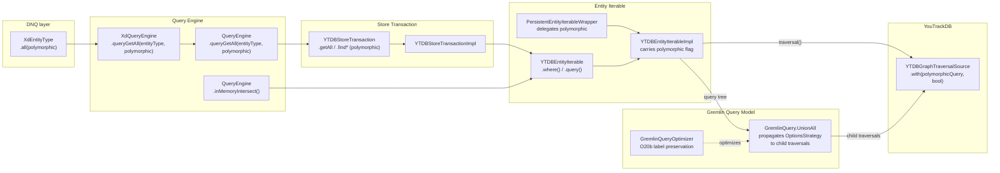

# Non-Polymorphic Query Support — Architecture Decision Record

## Summary

YouTrackDB's `hasLabel` traversal step matches a type and all its subclasses
by default (polymorphic semantics). This feature adds a `polymorphic: Boolean`
flag (default `true`) that lets callers opt into non-polymorphic queries where
`getAll("Parent")` returns only exact `Parent` instances. The flag is carried
on `YTDBEntityIterableImpl`, always set explicitly on the
`YTDBGraphTraversalSource`, validated at combination time, and exposed at
three API layers: entity iterable, store transaction, and DNQ entity type.
Two engine-level issues affecting non-polymorphic `union()`/`concat()`
operations were fixed: anonymous child traversal strategy propagation in
`GremlinQuery.UnionAll`, and `hasLabel` filter preservation in the O20b
optimizer path.

## Goals

- **Allow exact-type queries:** `getAll("Parent")` can return only exact
  `Parent` instances (not subclasses) when `polymorphic = false`.
  *Achieved as planned.*

- **Expose through three API layers:** `YTDBEntityIterable`,
  `YTDBStoreTransaction`, and `XdEntityType`.
  *Achieved as planned.*

- **Fail-fast on mixed-flag combinations:** Reject at combination time any
  attempt to merge a polymorphic iterable with a non-polymorphic one.
  *Achieved as planned.* `EMPTY` short-circuits before the check.
  `ByIds` queries (default `polymorphic = true`) are subject to the same
  validation — no bypass. Internal flag propagation through
  `QueryEngine.query()` (D7) ensures
  `filter()`/`filterIsInstance()`/`filterIsNotInstance()` produce
  flag-consistent operands.

## Constraints

- **Binary flag on the traversal source.** YouTrackDB's
  `YTDBGraphTraversalSource.with(YTDBQueryConfigParam.polymorphicQuery, Boolean)`
  controls the entire traversal — no per-step granularity.
  *Confirmed during implementation.*

- **Default must remain `true`.** All existing callers are polymorphic;
  the flag is opt-in for non-polymorphic behavior.
  *Maintained — all existing tests pass without modification.*

- **In-memory paths are unaffected.** `InMemoryEntityIterable` and
  `TransientEntityIterable` operate on materialized entity-ID sets, not
  Gremlin traversals.
  *Confirmed.*

- **`EMPTY` sentinel is neutral.** Combination methods short-circuit on
  `EMPTY` before reaching the flag check.
  *Confirmed. `EMPTY.polymorphic` returns `true` (the interface default)
  but the value is never compared because short-circuits execute first.*

- **New constraint discovered: explicit config always required.** YouTrackDB
  resolves `polymorphicQuery` via a two-level fallback: explicit traversal
  config → `GlobalConfiguration.QUERY_GREMLIN_POLYMORPHIC_BY_DEFAULT`.
  To avoid breakage if the global default changes, the flag is always set
  explicitly via `.with()` regardless of value.

- **New constraint discovered: anonymous traversal OptionsStrategy propagation.**
  TinkerPop's anonymous child traversals (used by `union()` steps) do not
  inherit the parent traversal's `OptionsStrategy`. `YTDBGraphStepStrategy`
  requires it to read `polymorphicQuery`, so `OptionsStrategy` must be
  explicitly added to each child traversal in `UnionAll.subtraversals()`.
  The graph reference is propagated automatically by TinkerPop.

## Architecture Notes

### Component Map

- **YTDBEntityIterableImpl** — carries the `polymorphic` flag as a constructor
  parameter. Applies it in `traversal()` via `.with(polymorphicQuery, polymorphic)`.
  Validates flag consistency in combination methods via `requirePolymorphicMatch()`.
  Propagates through `modify()`, `selectMany()`, and `findLinks()` (from
  `entities` parameter).
- **YTDBEntityIterable companion** — `where()` and `query()` factory methods
  accept `polymorphic: Boolean = true` (with `@JvmOverloads`).
- **PersistentEntityIterableWrapper** — delegates `polymorphic` to
  `unwrap()` with safe default `true`.
- **YTDBStoreTransaction / Impl** — 20+ query methods gain `polymorphic`
  parameter via two-method pattern (for Java-interface overrides) or Kotlin
  default parameters (for non-override methods).
- **QueryEngine** — single `queryGetAll(entityType, polymorphic = true)`.
  `inMemoryIntersect()` propagates the flag from the `YTDBEntityIterable`
  operand in the under-20 optimization path.
- **XdQueryEngine** — overrides `queryGetAll(entityType, polymorphic)` and
  wraps the result. Virtual dispatch ensures all paths go through `wrap()`.
- **XdEntityType.all(polymorphic)** — public DNQ entry point.
- **GremlinQuery.UnionAll** — `subtraversals()` adds the parent's
  `OptionsStrategy` to each anonymous child traversal, compensating for
  TinkerPop's lack of `OptionsStrategy` propagation to anonymous traversals
  inside `union()`. Only `OptionsStrategy` is propagated — the graph
  reference is inherited automatically.
- **GremlinQueryOptimizer** — O20b path re-applies `Labeled.of()` after
  distributing an intersect condition into `UnionAll` branches, preventing
  `hasLabel` filter loss.

### Decision Records

#### D1: Flag lives on YTDBEntityIterableImpl, not on GremlinQuery
- **Alternatives considered:** (A) Store on `GremlinQuery` nodes.
  (B) Store on `YTDBEntityIterableImpl`.
- **Decision:** Option B — the flag is a traversal execution concern, not a
  query-algebra concern.
- **Outcome:** Implemented as planned. The flag survives the
  `PersistentEntityIterableWrapper` wrapping layer via delegation.
  `findLinks()` correctly propagates from the `entities` parameter because
  the traversal starts from its query.

#### D2: Fail-fast on polymorphic/non-polymorphic combination
- **Alternatives considered:** (A) Silently coerce. (B) Throw error.
  (C) Split into two traversals.
- **Decision:** Option B — explicit, safe, caller-visible.
- **Outcome:** Implemented as planned via `requirePolymorphicMatch()`.
  The validation rejects all combinations of iterables with different
  polymorphic flags, including `ByIds` queries (see D8 revision).
  Internal combinations are handled by D7 (flag propagation through
  `NodeBase.instantiate()` in `QueryEngine.query()`).

#### D3: Default parameter values preserve backward compatibility
- **Alternatives considered:** (A) New method overloads.
  (B) Default parameter `polymorphic: Boolean = true`.
- **Decision:** Option B for Kotlin-native contexts. For Java-interface
  overrides in `YTDBStoreTransaction`, a two-method pattern was used
  (existing override gets default body delegating to new method with
  explicit parameter) because Java interface overrides cannot have
  Kotlin default parameters.
- **Outcome:** All existing call sites continue to work unchanged. The
  two-method pattern was not anticipated during planning but is a standard
  Kotlin-Java interop approach.

#### D4: Always set traversal config explicitly (emerged during implementation)
- **Context:** Discovered during Track 1 that YouTrackDB resolves
  `polymorphicQuery` via a two-level fallback: explicit traversal config →
  `GlobalConfiguration.QUERY_GREMLIN_POLYMORPHIC_BY_DEFAULT`.
- **Decision:** Always call `gs.with(YTDBQueryConfigParam.polymorphicQuery, polymorphic)`
  in `traversal()`, even when `polymorphic = true`. This overrides the
  global config explicitly in both directions.
- **Rationale:** Avoids silent breakage if the global default is ever changed
  or if test configurations set it differently. The cost is one additional
  `.with()` call per traversal, which is negligible.

#### D5: Propagate OptionsStrategy to anonymous child traversals (emerged during Track 5)

> **Superseded by D9** — the `addStrategies(optionsStrategy)` mechanism
> described below is concurrent-unsafe. D9 (Track 7) revises the mechanism
> to assign a fresh private `DefaultTraversalStrategies` to the child
> before propagating. Body kept as historical record.

- **Context:** `GremlinQuery.UnionAll.subtraversals()` originally created
  anonymous child traversals via `__.start()` without the parent's
  `OptionsStrategy`. `YTDBGraphStepStrategy` requires it to read
  `polymorphicQuery`.
- **Decision:** `subtraversals()` extracts the `OptionsStrategy` from the
  parent's strategies and adds it to each anonymous child via
  `admin.strategies.addStrategies()`. Only `OptionsStrategy` is propagated —
  the full strategy list and graph reference are inherited automatically by
  TinkerPop when the child is integrated into the parent via `union()`.
- **Rationale:** `GraphTraversal.with()` cannot be used — it is a step
  modulator, not traversal-wide config. Propagating only `OptionsStrategy`
  (rather than all strategies) avoids interfering with TinkerPop's own
  strategy application on child traversals.

#### D6: O20b label preservation after condition distribution (emerged during Track 5)
- **Context:** The Gremlin query optimizer's O20b path distributes an
  intersect condition into `UnionAll` branches. `extractCondition()` strips
  the `Labeled` wrapper, losing the `hasLabel` filter. TinkerPop's
  `InlineFilterStrategy` merges consecutive `HasStep` objects, and
  `YTDBHasLabelStep` evaluates multiple predicates with `anyMatch` (OR
  semantics).
- **Decision:** After distributing the condition into branches, re-apply
  the label via `Labeled.of()`. The `hasLabel` step is placed after the
  union at a different traversal level so `InlineFilterStrategy` cannot
  merge it with branch-level `hasLabel` steps.
- **Rationale:** Placing the label at a different traversal level (on the
  union result, not on each branch) avoids the OR-merge behavior while
  correctly filtering the combined result.

#### D7: Propagate polymorphic flag through NodeBase.instantiate() (Track 6)
- **Context:** `QueryEngine.query(instance, entityType, tree)` intersects
  `instance` with `tree.instantiate(...)`. When `instance` is non-polymorphic,
  the tree result was always polymorphic (default `true`), causing
  `requirePolymorphicMatch()` to reject the combination. This broke
  `filter()`, `filterIsInstance()`, and `filterIsNotInstance()` on
  non-polymorphic queries.
- **Alternatives considered:** (A) Add `polymorphic` parameter to
  `NodeBase.instantiate()`. (B) Relax `requirePolymorphicMatch()` for
  internal combinations. (C) Extract the query from the tree result and
  recreate it with the instance's flag.
- **Decision:** Option A — add a 4-parameter abstract
  `instantiate(entityType, queryEngine, metaData, polymorphic)` to
  `NodeBase` (Java). The 3-parameter method becomes concrete, delegating
  with `polymorphic = true`. `QueryEngine.query()` extracts the flag from
  `instance` via `(instance.unwrap() as? YTDBEntityIterable)?.polymorphic ?: true`
  and passes it to the 4-parameter `tree.instantiate()`.
- **Rationale:** Propagating through the creation path is consistent with
  how `polymorphic` flows through `YTDBStoreTransaction` methods (D3).
  Option B would remove the safety check for explicit user-level
  combinations. Option C creates a "create wrong then fix" pattern.

#### D8: ByIds queries are subject to requirePolymorphicMatch (Track 6, revised)
- **Context:** DNQ single-entity operations (`exclude(entity)`,
  `union(entity)`, `plus(entity)`) delegate to `queryOf()` which creates
  a `ByIds` iterable with default `polymorphic = true`. When the left
  operand is non-polymorphic (e.g., from `all(polymorphic = false)`),
  `requirePolymorphicMatch()` rejects the combination.
- **Initial decision (now reverted):** Bypass `requirePolymorphicMatch`
  for `ByIds` queries, treating them as flag-neutral sentinels (like
  `EMPTY`). The rationale was that `ByIds` looks up entities by ID, not
  by label, so the `polymorphicQuery` config should be irrelevant.
- **Why reverted:** While `ByIds` itself is ID-based, the `polymorphic`
  flag on the combined result iterable propagates to the traversal
  source's `OptionsStrategy`. For `union()`/`concat()` (which use
  `UnionAll`), this `OptionsStrategy` propagates to anonymous child
  subtraversals (Track 5 fix), causing the YouTrackDB engine to silently
  drop results from the `ByIds` branch under `polymorphicQuery=false`.
  Even for `intersect()`/`minus()` (which use `Aggregate` and are
  technically unaffected), allowing a silent flag mismatch is
  inconsistent and error-prone.
- **Current decision:** No bypass — `ByIds` queries with
  `polymorphic = true` (the default) cannot be combined with
  non-polymorphic iterables. `requirePolymorphicMatch()` throws
  `IllegalArgumentException` uniformly for all flag mismatches.
  Callers that need to combine `ByIds` with non-polymorphic iterables
  must ensure both operands have matching flags.
- **Rationale:** Fail-fast is safer than silent data loss. The bypass
  was originally added to support `exclude(entity)`, `union(entity)`,
  and `plus(entity)` on non-polymorphic queries, but these patterns
  silently lost results in the `union`/`concat` path. Rejecting the
  combination forces callers to handle the flag explicitly.

#### D9: Use a private strategies container for UnionAll anonymous children (Track 7 — revises D5)

- **Context:** D5's original mechanism called
  `child.asAdmin().strategies.addStrategies(optionsStrategy)` on
  anonymous child traversals created via `__.start<Any>()`. In TinkerPop,
  `__.start()` instantiates a `DefaultGraphTraversal()` whose
  `strategies` field is **aliased** to the process-wide singleton
  returned by `TraversalStrategies.GlobalCache.getStrategies(EmptyGraph.class)`
  (`DefaultTraversal.java:103`). Concurrent `addStrategies` calls from
  multiple threads raced on the underlying `LinkedHashSet` and threw
  `ConcurrentModificationException` from
  `DefaultTraversalStrategies.sortStrategies`. The mechanism also
  permanently leaked every `OptionsStrategy` instance ever propagated
  into the global cache. The bug surfaced as a
  `ConcurrentModificationException` in the YouTrack/youtrackdb-migration
  project under normal concurrent request load.
- **Alternatives considered:**
  1. `clone()` the aliased strategies, then add `OptionsStrategy`. Works,
     but clones an empty global container — conceptually awkward; same
     end-state as allocating a fresh empty container, with less clear
     intent.
  2. Use `DefaultGraphTraversal(gs)` (non-anonymous, inherits strategies
     from the source) for the child. Only works in `startTraversal(gs)`;
     `continueTraversal(parent, …)` has no source — would create
     asymmetric code paths and still alias a shared container.
  3. Fix on the consumer side — change YouTrackDB's
     `YTDBStrategyUtil.isPolymorphic(traversal)` to read `OptionsStrategy`
     from the root via `TraversalHelper.getRootTraversal(traversal)`.
     Eliminates child-level strategy mutation entirely; architecturally
     cleanest. Requires a coordinated cross-repo change; deferred as
     future work.
  4. Synchronize on the shared strategies object before
     `addStrategies`. Fixes the CME but not the permanent global-cache
     pollution; rejected.
- **Decision:** Replace the child's `strategies` field with a freshly
  allocated `DefaultTraversalStrategies` holding only the
  `OptionsStrategy`. The child's `strategies` field is reassigned (via
  the `Traversal.Admin` SPI) **before** any `addStrategies` call, so the
  alias to the shared global is broken immediately and no shared state
  is ever written to.
- **Rationale:** Works because child traversals' strategies are only
  read — never iterated — during strategy application
  (`DefaultTraversal.applyStrategies` iterates only when `isRoot()`, see
  `DefaultTraversal.java:144`). Provider strategies like
  `YTDBGraphStepStrategy` call `child.getStrategies().getStrategy(OptionsStrategy.class)`
  once to read `polymorphicQuery`. Immediately after strategy
  application, `lock()` overwrites the child's `strategies` with the
  parent's (`DefaultTraversal.java:338`), so the private container's
  lifetime is bounded to a single pass. `EmptyGraph`'s default strategies
  are empty (`TraversalStrategies.java:292`), so a fresh container
  provides the same starting state as the original alias.
- **Risks/Caveats:** The correctness argument depends on three
  TinkerPop implementation facts. **A TinkerPop (and youtrackdb-core)
  upgrade must re-verify each of them:**
  1. `DefaultTraversal()`'s no-arg constructor aliases
     `TraversalStrategies.GlobalCache.getStrategies(EmptyGraph.class)`
     (i.e., the field is assigned by reference, not copied).
  2. `DefaultTraversal.applyStrategies` iterates its `strategies`
     field only when `isRoot()` holds — non-root (child) traversals
     never iterate their own strategies during strategy application.
  3. `DefaultTraversal.lock()` overwrites non-root child strategies
     with `parentTraversal.getStrategies()` before strategy
     application returns, bounding the lifetime of the private
     container to a single strategy-application pass.

  If any of these facts changes, the correctness of the mechanism
  must be re-evaluated; the consumer-side read-from-root approach
  (Alternative 3 above) becomes the natural next step.

  **Future work (recommended forward direction):** Alternative 3 —
  changing YouTrackDB's `YTDBStrategyUtil.isPolymorphic` to read
  `OptionsStrategy` from the root via
  `TraversalHelper.getRootTraversal(traversal)` — remains the
  architecturally cleanest long-term fix. Any follow-up regression in
  this area should pursue it rather than further complicating the
  child-side propagation.
- **Regression test:**
  `YTDBPolymorphicQueryTest."UnionAll subtraversals does not mutate shared
  EmptyGraph strategies"` — single-threaded structural check. Snapshots
  `TraversalStrategies.GlobalCache.getStrategies(EmptyGraph.class)` at
  test entry, runs one `union(a, b).count()` on two non-polymorphic label
  queries, and asserts the strategy list is unchanged index-by-index by
  reference identity (`===`). This tests the D9 invariant directly — the
  `ConcurrentModificationException` observed under the pre-fix code was a
  symptom of the same shared-container mutation this assertion catches,
  so reproducing the race is unnecessary. The pre-fix
  `child.asAdmin().strategies.addStrategies(optionsStrategy)` call would
  either insert a new `OptionsStrategy` (when the cache starts clean) or
  replace a pre-existing one (since `addStrategies` removes any same-class
  incumbent first); the index-by-identity comparison detects both. Class
  equality alone — `AbstractTraversalStrategy.equals` compares by class —
  would hide the replacement case if the shared cache is already polluted
  from a prior test in the same JVM fork.

### Invariants

- A `YTDBEntityIterableImpl` with `polymorphic = false` produces a traversal
  with `YTDBQueryConfigParam.polymorphicQuery = false` on the source.
- A `YTDBEntityIterableImpl` with `polymorphic = true` produces a traversal
  with `YTDBQueryConfigParam.polymorphicQuery = true` (explicitly set, not
  relying on default).
- Combining two `YTDBEntityIterableImpl` with different `polymorphic` values
  via `intersect`/`union`/`minus`/`concat` throws `IllegalArgumentException`
  — no exceptions, including `ByIds` queries (see D8 revision).
- `YTDBEntityIterable.EMPTY` is compatible with either flag value (combination
  methods short-circuit before the flag check).
- Single-operand transforms propagate `this.polymorphic`; `findLinks()`
  propagates `entities.polymorphic`.
- `QueryEngine.query()` matches the tree result's polymorphic flag to the
  instance's flag before intersecting — `filter()`, `filterIsInstance()`,
  and `filterIsNotInstance()` work correctly on non-polymorphic queries.
- `UnionAll.subtraversals()` does not mutate any strategies container
  that it did not privately allocate (D9). Concurrent UnionAll queries
  must not throw `ConcurrentModificationException` — enforced by the
  regression test cited in D9.
- All existing tests pass without modification.

### Non-Goals

- Per-step polymorphism within a single Gremlin traversal (YouTrackDB doesn't
  support this).
- Automatic splitting of mixed-polymorphic queries into separate traversals.
- Fixing YouTrackDB engine-level `hasLabel` merging behavior (guarded at the
  optimizer level instead).

## Key Discoveries

1. **YouTrackDB's two-level config fallback.** The engine resolves
   `polymorphicQuery` via explicit traversal config →
   `GlobalConfiguration.QUERY_GREMLIN_POLYMORPHIC_BY_DEFAULT` (set to `true`
   in `YTDBDatabaseParams`). Relying on the global default is fragile — the
   implementation always sets the flag explicitly. (Track 1, Step 1)

2. **Gremlin query optimizer merges HasLabel conditions.** Combining
   non-polymorphic queries via `union()`/`concat()` on types with an
   inheritance relationship produces incorrect results. The optimizer merges
   `HasLabel("BaseUser") OR HasLabel("User")` into a combined condition that
   doesn't correctly interact with `polymorphicQuery = false`. This is a
   YouTrackDB engine limitation, documented but not addressed (consistent
   with the non-goals). (Track 1, Step 4)

3. **Java-interface override limitation requires two-method pattern.** Kotlin
   default parameters cannot be used on methods that override Java interface
   methods. The `YTDBStoreTransaction` API uses a two-method pattern: the
   existing override gets a default body delegating to a new overloaded
   method with the explicit `polymorphic` parameter. Non-override methods
   use Kotlin default parameters directly. (Track 3, Step 1)

4. **`filter()` on non-polymorphic queries — initially threw, fixed in Track 6.**
   `QueryEngine.query()` internally intersects the non-polymorphic iterable
   with a tree-instantiated iterable. Before Track 6, `NodeBase.instantiate()`
   always produced polymorphic iterables (default `true`), causing
   `requirePolymorphicMatch()` to reject the combination. Track 6 adds a
   `polymorphic` parameter to `NodeBase.instantiate()` and wires it through
   `QueryEngine.query()`, resolving the mismatch. `filter()`,
   `filterIsInstance()`, and `filterIsNotInstance()` now work correctly on
   non-polymorphic queries. (Track 4, Step 2; fixed in Track 6)

5. **`sortedBy()` flag reverts to `true`.** `SortEngine.sort()` creates a
   new iterable via `txn.sort()` which defaults to `polymorphic = true`.
   The sorted result content is correct (only exact-type instances), but
   the flag reverts. Neither limitation affects the primary use case.
   (Track 4, Step 2)

6. **`findLinks()` propagates from `entities`, not `this`.** The result's
   query tree is built from `entities.query`, not `this.query`, so the
   polymorphic flag must come from the `entities` parameter. This was
   specified in the plan and confirmed during implementation. (Track 1,
   Step 2)

7. **`Comparable<Nothing>` to `Comparable<*>` type widening.** New
   overloaded `find` methods use `Comparable<*>` instead of
   `Comparable<Nothing>` because they are no longer direct Java interface
   overrides. This is a cosmetic alignment with Java raw types, not a
   behavioral change. (Track 3, Step 1)

8. **Anonymous traversals lose parent OptionsStrategy.** TinkerPop's
   anonymous child traversals (created via `__.start()`) do not inherit
   the parent's `OptionsStrategy`. `YTDBGraphStepStrategy` requires it
   to read `polymorphicQuery`. This caused `union()`/`concat()` on
   non-polymorphic queries with inherited types to return polymorphic
   results. Fixed by adding the parent's `OptionsStrategy` to each child
   traversal in `UnionAll.subtraversals()`. The graph reference is
   propagated automatically by TinkerPop. `GraphTraversal.with()` cannot
   be used — it is a step modulator, not traversal-wide config.
   (Track 5, Step 1)

9. **O20b optimizer loses Labeled wrapper during condition distribution.**
   When the optimizer distributes an intersect condition into `UnionAll`
   branches, `extractCondition()` strips the `Labeled` wrapper, losing the
   `hasLabel` filter. This caused `union().intersect(type)` to silently
   skip the type filter when the extracted condition was `All`. Fixed by
   re-applying `Labeled.of()` after distribution — the `hasLabel` step is
   placed after the union at a different traversal level. Pre-existing bug,
   not caused by the polymorphic flag feature. (Track 5, Step 2)

10. **TinkerPop HasLabel step merging with OR semantics.** `InlineFilterStrategy`
    merges consecutive `HasStep` objects; `YTDBHasLabelStep` evaluates
    multiple predicates with `anyMatch` (OR semantics), so
    `hasLabel("Child").hasLabel("Parent")` matches anything that is either
    `Child` or `Parent`. The optimizer guards against this at three points:
    the O7 double-label guard (falls to Aggregate), the O20b label placement
    (different traversal level), and the O19 `extractCondition` guard.
    (Track 5, Step 2)

11. **`ByIds` queries cannot be safely combined with non-polymorphic
    iterables.** DNQ single-entity operations (`exclude(entity)`,
    `union(entity)`, `plus(entity)`) wrap the entity via `queryOf()` which
    creates a `ByIds` iterable with default `polymorphic = true`. While
    `ByIds` itself looks up entities by ID (not by label), the `polymorphic`
    flag on the combined result propagates to the traversal source's
    `OptionsStrategy`. For `union`/`concat` (which use `UnionAll`), this
    `OptionsStrategy` propagates to anonymous child subtraversals (Track 5),
    causing the engine to silently drop `ByIds` results under
    `polymorphicQuery=false`. An initial bypass (treating `ByIds` as
    flag-neutral) was reverted because it masked this silent data loss.
    `requirePolymorphicMatch()` now rejects all flag mismatches uniformly,
    including `ByIds`. The private `filterNotNull(entityType)` in
    `XdQuery.kt` had a related issue: it called `YTDBEntityIterable.where()`
    without passing `this.polymorphic`, creating a default-polymorphic
    iterable that would fail the flag check when intersected with a
    non-polymorphic receiver — fixed by propagating `this.polymorphic`.
    (Track 6, revised)

12. **TinkerPop's `__.start()` aliases the `EmptyGraph` global strategies
    cache.** `DefaultTraversal()`'s no-arg constructor sets
    `this.strategies = TraversalStrategies.GlobalCache.getStrategies(EmptyGraph.class)`
    by reference (`DefaultTraversal.java:103`). Every anonymous traversal
    in the JVM points at the same `DefaultTraversalStrategies` instance.
    Track 5's original D5 mechanism
    (`child.asAdmin().strategies.addStrategies(optionsStrategy)`) mutated
    this shared singleton, racing across threads on the backing
    `LinkedHashSet` and throwing `ConcurrentModificationException` from
    `DefaultTraversalStrategies.sortStrategies`. The same mutation also
    permanently accumulated every `OptionsStrategy` instance into the
    global cache. Track 7 (D9) breaks the alias by assigning a fresh
    private `DefaultTraversalStrategies` to the child before any
    `addStrategies` call. The correctness argument relies on three
    TinkerPop facts: the `EmptyGraph` alias, that `applyStrategies`
    iterates strategies only on root traversals, and that `lock()`
    overwrites child strategies with the parent's after strategy
    application. (Track 7)
