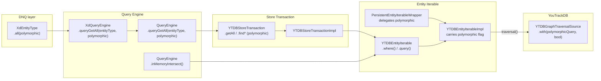

# Non-Polymorphic Query Support — Architecture Decision Record

## Summary

YouTrackDB's `hasLabel` traversal step matches a type and all its subclasses
by default (polymorphic semantics). This feature adds a `polymorphic: Boolean`
flag (default `true`) that lets callers opt into non-polymorphic queries where
`getAll("Parent")` returns only exact `Parent` instances. The flag is carried
on `YTDBEntityIterableImpl`, always set explicitly on the
`YTDBGraphTraversalSource`, validated at combination time, and exposed at
three API layers: entity iterable, store transaction, and DNQ entity type.

## Goals

- **Allow exact-type queries:** `getAll("Parent")` can return only exact
  `Parent` instances (not subclasses) when `polymorphic = false`.
  *Achieved as planned.*

- **Expose through three API layers:** `YTDBEntityIterable`,
  `YTDBStoreTransaction`, and `XdEntityType`.
  *Achieved as planned.*

- **Fail-fast on mixed-flag combinations:** Reject at combination time any
  attempt to merge a polymorphic iterable with a non-polymorphic one.
  *Achieved as planned.* The validation also catches unintended mixing
  through DNQ query extensions (e.g., `filter()` on a non-polymorphic query).

## Constraints

- **Binary flag on the traversal source.** YouTrackDB's
  `YTDBGraphTraversalSource.with(YTDBQueryConfigParam.polymorphicQuery, Boolean)`
  controls the entire traversal — no per-step granularity.
  *Confirmed during implementation.*

- **Default must remain `true`.** All existing callers are polymorphic;
  the flag is opt-in for non-polymorphic behavior.
  *Maintained — all existing tests pass without modification.*

- **In-memory paths are unaffected.** `InMemoryEntityIterable` and
  `TransientEntityIterable` operate on materialized entity-ID sets, not
  Gremlin traversals.
  *Confirmed.*

- **`EMPTY` sentinel is neutral.** Combination methods short-circuit on
  `EMPTY` before reaching the flag check.
  *Confirmed. `EMPTY.polymorphic` returns `true` (the interface default)
  but the value is never compared because short-circuits execute first.*

- **New constraint discovered: explicit config always required.** YouTrackDB
  resolves `polymorphicQuery` via a two-level fallback: explicit traversal
  config → `GlobalConfiguration.QUERY_GREMLIN_POLYMORPHIC_BY_DEFAULT`.
  To avoid breakage if the global default changes, the flag is always set
  explicitly via `.with()` regardless of value.

## Architecture Notes

### Component Map

- **YTDBEntityIterableImpl** — carries the `polymorphic` flag as a constructor
  parameter. Applies it in `traversal()` via `.with(polymorphicQuery, polymorphic)`.
  Validates flag consistency in combination methods via `requirePolymorphicMatch()`.
  Propagates through `modify()`, `selectMany()`, and `findLinks()` (from
  `entities` parameter).
- **YTDBEntityIterable companion** — `where()` and `query()` factory methods
  accept `polymorphic: Boolean = true` (with `@JvmOverloads`).
- **PersistentEntityIterableWrapper** — delegates `polymorphic` to
  `unwrap()` with safe default `true`.
- **YTDBStoreTransaction / Impl** — 20+ query methods gain `polymorphic`
  parameter via two-method pattern (for Java-interface overrides) or Kotlin
  default parameters (for non-override methods).
- **QueryEngine** — single `queryGetAll(entityType, polymorphic = true)`.
  `inMemoryIntersect()` propagates the flag from the `YTDBEntityIterable`
  operand in the under-20 optimization path.
- **XdQueryEngine** — overrides `queryGetAll(entityType, polymorphic)` and
  wraps the result. Virtual dispatch ensures all paths go through `wrap()`.
- **XdEntityType.all(polymorphic)** — public DNQ entry point.

### Decision Records

#### D1: Flag lives on YTDBEntityIterableImpl, not on GremlinQuery
- **Alternatives considered:** (A) Store on `GremlinQuery` nodes.
  (B) Store on `YTDBEntityIterableImpl`.
- **Decision:** Option B — the flag is a traversal execution concern, not a
  query-algebra concern.
- **Outcome:** Implemented as planned. The flag survives the
  `PersistentEntityIterableWrapper` wrapping layer via delegation.
  `findLinks()` correctly propagates from the `entities` parameter because
  the traversal starts from its query.

#### D2: Fail-fast on polymorphic/non-polymorphic combination
- **Alternatives considered:** (A) Silently coerce. (B) Throw error.
  (C) Split into two traversals.
- **Decision:** Option B — explicit, safe, caller-visible.
- **Outcome:** Implemented as planned via `requirePolymorphicMatch()`.
  The validation also caught an unintended interaction: `filter()` on a
  non-polymorphic query triggers the check because `QueryEngine.query()`
  internally intersects with a default-polymorphic filter predicate.
  This fail-fast behavior is correct — it prevents silently wrong results.

#### D3: Default parameter values preserve backward compatibility
- **Alternatives considered:** (A) New method overloads.
  (B) Default parameter `polymorphic: Boolean = true`.
- **Decision:** Option B for Kotlin-native contexts. For Java-interface
  overrides in `YTDBStoreTransaction`, a two-method pattern was used
  (existing override gets default body delegating to new method with
  explicit parameter) because Java interface overrides cannot have
  Kotlin default parameters.
- **Outcome:** All existing call sites continue to work unchanged. The
  two-method pattern was not anticipated during planning but is a standard
  Kotlin-Java interop approach.

#### D4: Always set traversal config explicitly (emerged during implementation)
- **Context:** Discovered during Track 1 that YouTrackDB resolves
  `polymorphicQuery` via a two-level fallback: explicit traversal config →
  `GlobalConfiguration.QUERY_GREMLIN_POLYMORPHIC_BY_DEFAULT`.
- **Decision:** Always call `gs.with(YTDBQueryConfigParam.polymorphicQuery, polymorphic)`
  in `traversal()`, even when `polymorphic = true`. This overrides the
  global config explicitly in both directions.
- **Rationale:** Avoids silent breakage if the global default is ever changed
  or if test configurations set it differently. The cost is one additional
  `.with()` call per traversal, which is negligible.

### Invariants

- A `YTDBEntityIterableImpl` with `polymorphic = false` produces a traversal
  with `YTDBQueryConfigParam.polymorphicQuery = false` on the source.
- A `YTDBEntityIterableImpl` with `polymorphic = true` produces a traversal
  with `YTDBQueryConfigParam.polymorphicQuery = true` (explicitly set, not
  relying on default).
- Combining two `YTDBEntityIterableImpl` with different `polymorphic` values
  via `intersect`/`union`/`minus`/`concat` throws `IllegalArgumentException`.
- `YTDBEntityIterable.EMPTY` is compatible with either flag value (combination
  methods short-circuit before the flag check).
- Single-operand transforms propagate `this.polymorphic`; `findLinks()`
  propagates `entities.polymorphic`.
- All existing tests pass without modification.

### Non-Goals

- Per-step polymorphism within a single Gremlin traversal (YouTrackDB doesn't
  support this).
- Automatic splitting of mixed-polymorphic queries into separate traversals.
- Changes to the `GremlinQuery` sealed hierarchy or `GremlinQueryOptimizer`.

## Key Discoveries

1. **YouTrackDB's two-level config fallback.** The engine resolves
   `polymorphicQuery` via explicit traversal config →
   `GlobalConfiguration.QUERY_GREMLIN_POLYMORPHIC_BY_DEFAULT` (set to `true`
   in `YTDBDatabaseParams`). Relying on the global default is fragile — the
   implementation always sets the flag explicitly. (Track 1, Step 1)

2. **Gremlin query optimizer merges HasLabel conditions.** Combining
   non-polymorphic queries via `union()`/`concat()` on types with an
   inheritance relationship produces incorrect results. The optimizer merges
   `HasLabel("BaseUser") OR HasLabel("User")` into a combined condition that
   doesn't correctly interact with `polymorphicQuery = false`. This is a
   YouTrackDB engine limitation, documented but not addressed (consistent
   with the non-goals). (Track 1, Step 4)

3. **Java-interface override limitation requires two-method pattern.** Kotlin
   default parameters cannot be used on methods that override Java interface
   methods. The `YTDBStoreTransaction` API uses a two-method pattern: the
   existing override gets a default body delegating to a new overloaded
   method with the explicit `polymorphic` parameter. Non-override methods
   use Kotlin default parameters directly. (Track 3, Step 1)

4. **`filter()` on non-polymorphic queries throws.** `QueryEngine.query()`
   internally intersects the non-polymorphic iterable with a
   default-polymorphic filter predicate iterable. The combination validation
   catches this mismatch and throws `IllegalArgumentException`. Users
   requiring filtered non-polymorphic results should use
   `YTDBStoreTransaction.find*()` methods directly. (Track 4, Step 2)

5. **`sortedBy()` flag reverts to `true`.** `SortEngine.sort()` creates a
   new iterable via `txn.sort()` which defaults to `polymorphic = true`.
   The sorted result content is correct (only exact-type instances), but
   the flag reverts. Neither limitation affects the primary use case.
   (Track 4, Step 2)

6. **`findLinks()` propagates from `entities`, not `this`.** The result's
   query tree is built from `entities.query`, not `this.query`, so the
   polymorphic flag must come from the `entities` parameter. This was
   specified in the plan and confirmed during implementation. (Track 1,
   Step 2)

7. **`Comparable<Nothing>` to `Comparable<*>` type widening.** New
   overloaded `find` methods use `Comparable<*>` instead of
   `Comparable<Nothing>` because they are no longer direct Java interface
   overrides. This is a cosmetic alignment with Java raw types, not a
   behavioral change. (Track 3, Step 1)
