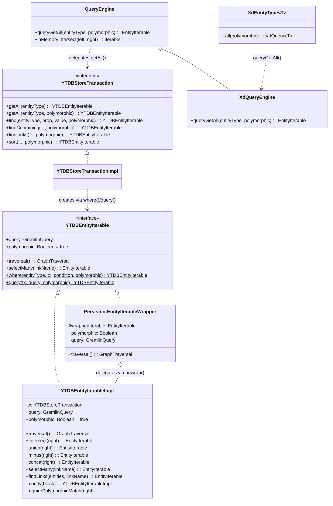
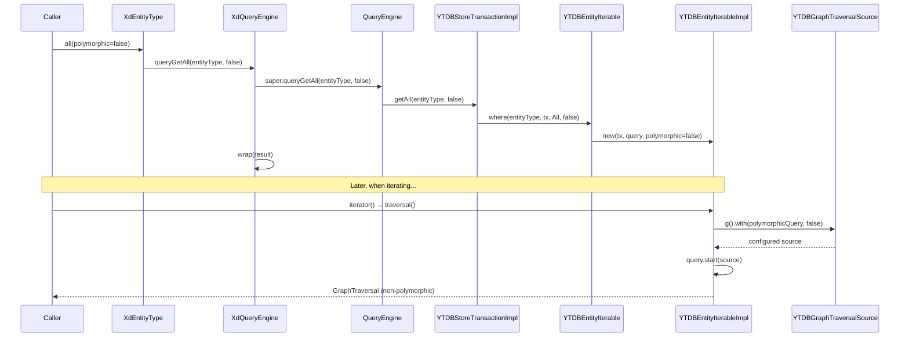
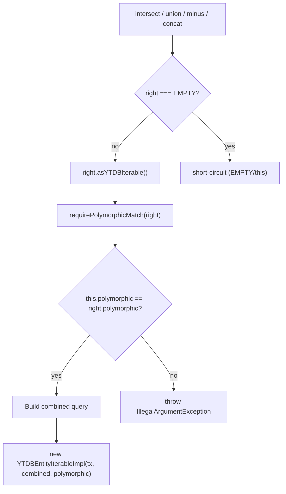
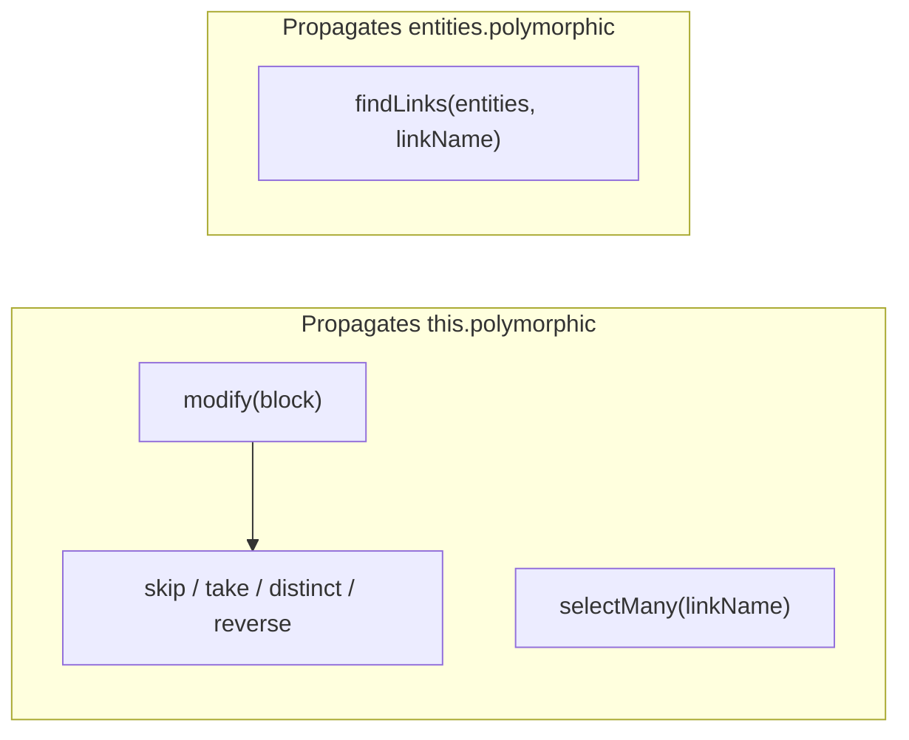

# Non-Polymorphic Query Support — Final Design

## Overview

This feature adds a `polymorphic: Boolean` flag to the query execution path
so that `hasLabel("Type")` can optionally match only the exact type
(non-polymorphic) instead of the type and all its subclasses (polymorphic,
the default). The flag is carried on `YTDBEntityIterableImpl`, explicitly
applied to the `YTDBGraphTraversalSource` at traversal-build time
(always, for both `true` and `false`), validated when two iterables are
combined, and surfaced through three API layers: entity iterable factories,
store transaction methods, and DNQ entity types.

**Deviations from original design:**
- The traversal source is **always** configured via
  `.with(polymorphicQuery, polymorphic)` regardless of flag value, not just
  when `false`. This was discovered during implementation — YouTrackDB uses a
  two-level fallback (explicit config → global default), and relying on the
  global default is fragile.
- `YTDBStoreTransaction` methods use a **two-method pattern** (override
  with default body delegating to a new overloaded method) instead of plain
  Kotlin default parameters, because Java-interface overrides cannot have
  default parameters.
- `QueryEngine.queryGetAll` is a single method with a default parameter
  (the two-method pattern was only needed for Java-interface overrides in
  `YTDBStoreTransaction`).

## Class Design

**YTDBEntityIterable** defines `polymorphic: Boolean` with a default getter
returning `true`. The `EMPTY` sentinel inherits this default. The companion
factory methods `where()` and `query()` accept `polymorphic: Boolean = true`
(with `@JvmOverloads`) and pass it to the `YTDBEntityIterableImpl` constructor.

**YTDBEntityIterableImpl** stores `polymorphic` as a constructor parameter.
`traversal()` always calls `gs.with(YTDBQueryConfigParam.polymorphicQuery, polymorphic)`
to explicitly configure the traversal source. All methods that create new
instances propagate the flag: `modify()` (used by `skip`, `take`, `distinct`,
`reverse`), `selectMany()`, and combination methods (`intersect`, `union`,
`minus`, `concat`). `findLinks(entities, linkName)` propagates from the
`entities` parameter (not `this`) because the result's query tree is built
from `entities.query`.

**PersistentEntityIterableWrapper** delegates `polymorphic` to the unwrapped
inner iterable: `(unwrap() as? YTDBEntityIterable)?.polymorphic ?: true`.
The safe default of `true` matches the interface default for non-YTDB iterables.

**YTDBStoreTransaction** adds `polymorphic: Boolean` to 20+ query methods
using a two-method pattern: the existing Java-interface override gets a
default body delegating to a new overloaded method with the explicit
`polymorphic` parameter. Non-override methods use Kotlin default parameters
directly.

**QueryEngine** has a single `queryGetAll(entityType, polymorphic = true)`
method. `inMemoryIntersect()` propagates the flag from the `YTDBEntityIterable`
operand in the under-20 optimization path.

**XdQueryEngine** overrides `queryGetAll(entityType, polymorphic)` and wraps
the result via `wrap()`. The base `QueryEngine`'s single-arg call delegates
to the two-arg version, so virtual dispatch routes all paths through wrapping.

**XdEntityType.all(polymorphic)** is the public DNQ entry point.

## Workflow

### Query creation and traversal execution

The flag is set at construction time and applied at traversal time. When
`polymorphic` is `true`, `.with(polymorphicQuery, true)` is still called —
this explicitly overrides the global configuration rather than relying on the
engine's two-level fallback default.

### Combination validation flow

All four combination methods follow the same pattern. The `EMPTY`
short-circuit executes before the flag check — `EMPTY` is always compatible.
`intersectSavingOrder` delegates to `intersect()` and inherits the check.

### Flag propagation through single-operand transforms

`modify()` is a private helper that creates a new `YTDBEntityIterableImpl`
with `this.polymorphic`. It is used by `skip()`, `take()`, `distinct()`,
and the reverse path. `selectMany()` creates a `FollowLink` query and
passes `this.polymorphic`. `findLinks()` is the exception: the result's
query tree starts from `entities.query`, so it propagates
`entities.asYTDBIterable().polymorphic`.

## Known limitations at the DNQ level

Two limitations exist when combining non-polymorphic queries with DNQ
query extensions:

1. **`filter()` throws `IllegalArgumentException`** — `QueryEngine.query()`
   internally intersects the non-polymorphic iterable instance with a
   default-polymorphic filter predicate iterable. Track 2's combination
   validation catches the flag mismatch and rejects it. Users requiring
   filtered non-polymorphic results should use `YTDBStoreTransaction.find*()`
   methods with `polymorphic = false` directly.

2. **`sortedBy()` flag reverts to `true`** — `SortEngine.sort()` creates a
   new iterable via `txn.sort()` which defaults to `polymorphic = true`. The
   sorted result content is correct (only exact-type instances appear), but
   the flag on the resulting iterable is `true`. This means a subsequent
   combination with a non-polymorphic iterable would not throw, even though
   semantically the results came from a non-polymorphic query.

Neither limitation affects the primary use case: `all(polymorphic = false)`
for exact-type queries, with further filtering done at the transaction level.

## Gremlin query optimizer interaction

The Gremlin query optimizer merges `HasLabel` conditions in `union`/`concat`
operations. When combining non-polymorphic queries on types with an
inheritance relationship (e.g., `HasLabel("BaseUser") OR HasLabel("User")`),
the merged condition does not correctly interact with
`polymorphicQuery = false`. This is a YouTrackDB engine limitation, not a
flag propagation issue. The plan's non-goals explicitly exclude optimizer
changes.
