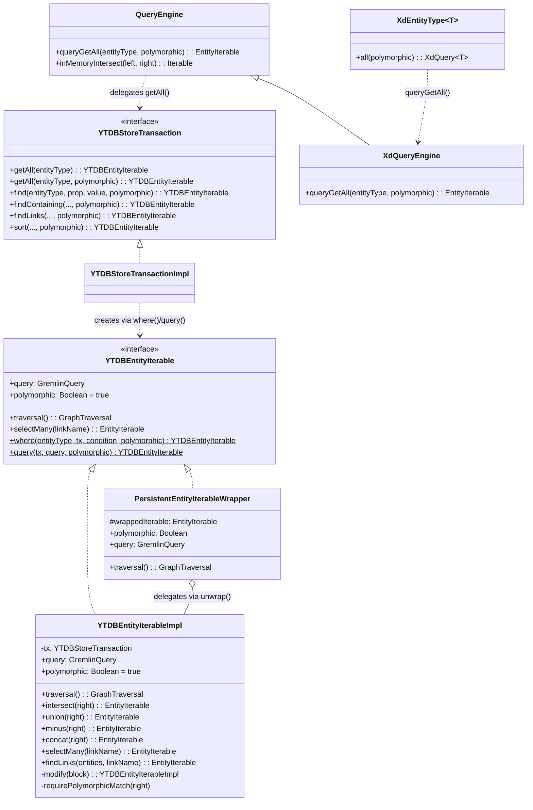
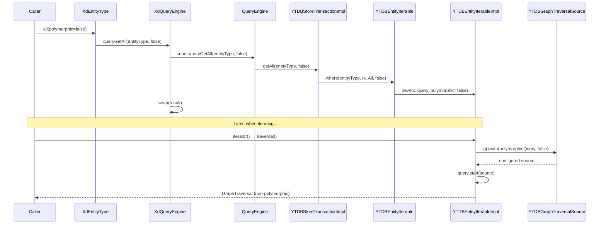
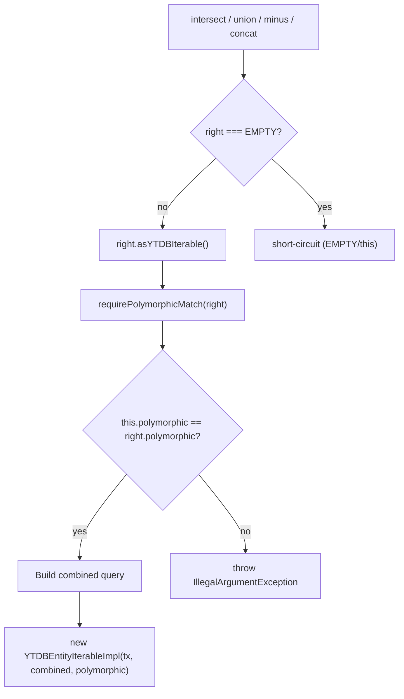
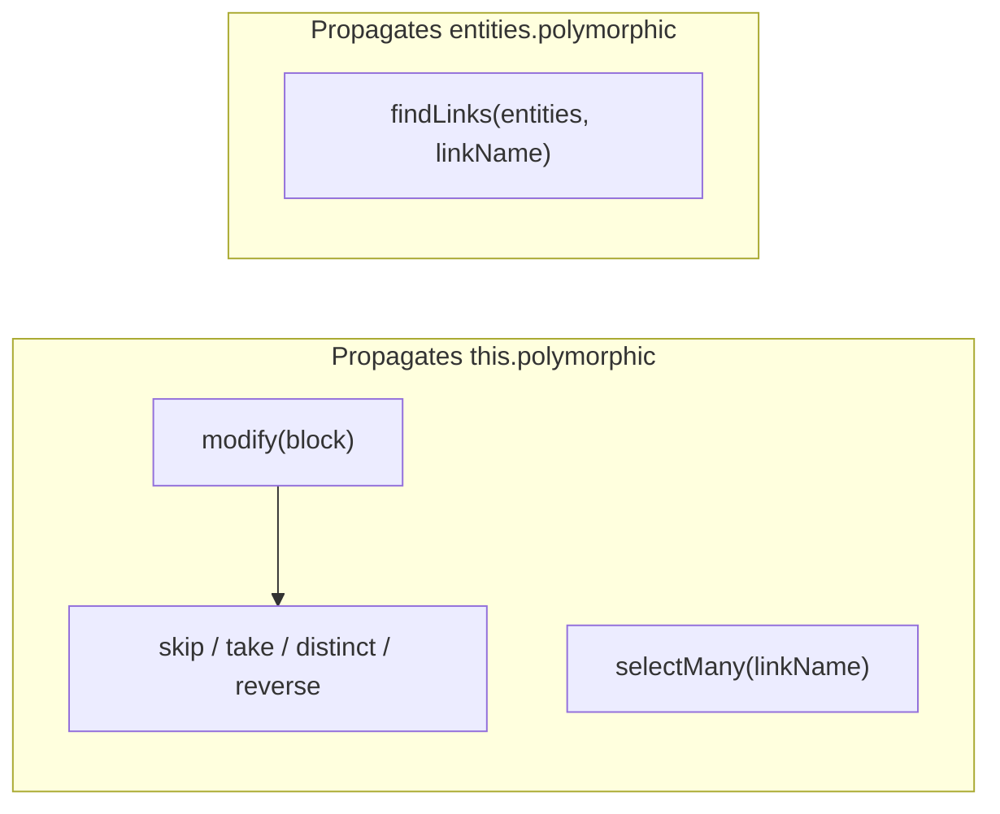
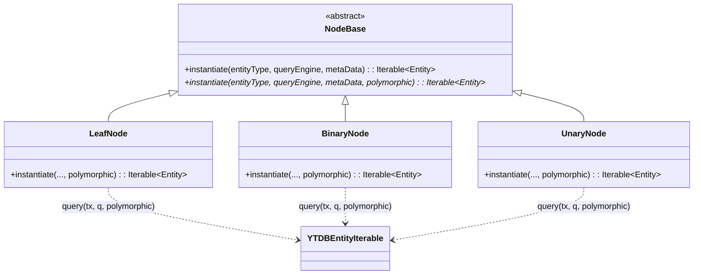
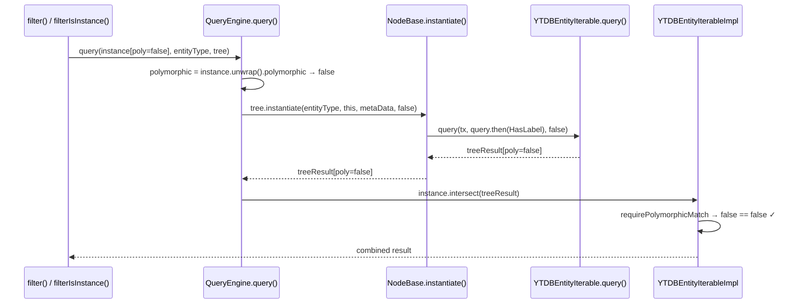
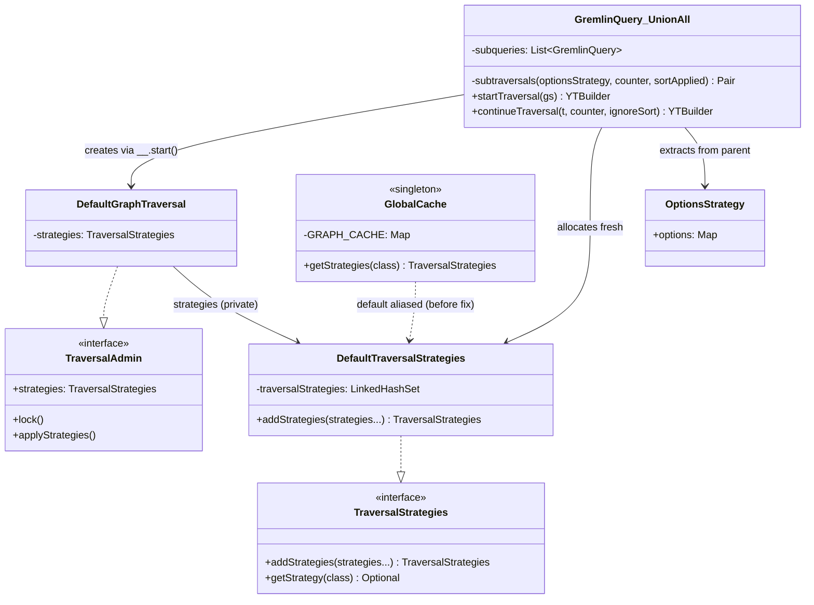
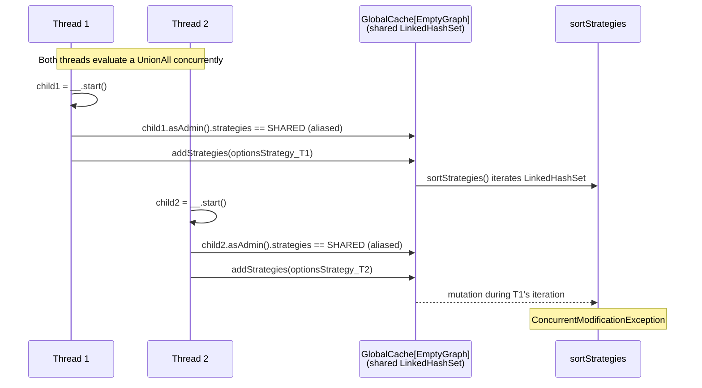
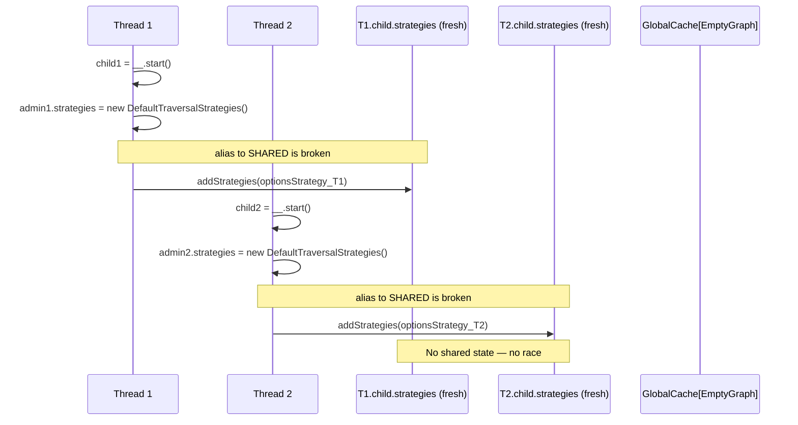
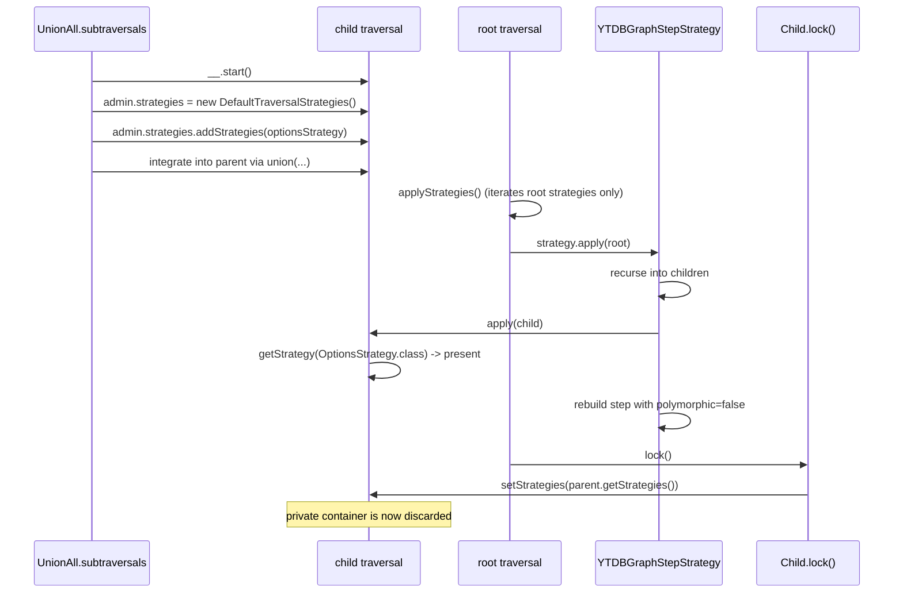

# Non-Polymorphic Query Support — Final Design

## Overview

This feature adds a `polymorphic: Boolean` flag to the query execution path
so that `hasLabel("Type")` can optionally match only the exact type
(non-polymorphic) instead of the type and all its subclasses (polymorphic,
the default). The flag is carried on `YTDBEntityIterableImpl`, explicitly
applied to the `YTDBGraphTraversalSource` at traversal-build time
(always, for both `true` and `false`), validated when two iterables are
combined, and surfaced through three API layers: entity iterable factories,
store transaction methods, and DNQ entity types.

**Deviations from original design:**
- The traversal source is **always** configured via
  `.with(polymorphicQuery, polymorphic)` regardless of flag value, not just
  when `false`. This was discovered during implementation — YouTrackDB uses a
  two-level fallback (explicit config → global default), and relying on the
  global default is fragile.
- `YTDBStoreTransaction` methods use a **two-method pattern** (override
  with default body delegating to a new overloaded method) instead of plain
  Kotlin default parameters, because Java-interface overrides cannot have
  default parameters.
- `QueryEngine.queryGetAll` is a single method with a default parameter
  (the two-method pattern was only needed for Java-interface overrides in
  `YTDBStoreTransaction`).

## Class Design

**YTDBEntityIterable** defines `polymorphic: Boolean` with a default getter
returning `true`. The `EMPTY` sentinel inherits this default. The companion
factory methods `where()` and `query()` accept `polymorphic: Boolean = true`
(with `@JvmOverloads`) and pass it to the `YTDBEntityIterableImpl` constructor.

**YTDBEntityIterableImpl** stores `polymorphic` as a constructor parameter.
`traversal()` always calls `gs.with(YTDBQueryConfigParam.polymorphicQuery, polymorphic)`
to explicitly configure the traversal source. All methods that create new
instances propagate the flag: `modify()` (used by `skip`, `take`, `distinct`,
`reverse`), `selectMany()`, and combination methods (`intersect`, `union`,
`minus`, `concat`). `findLinks(entities, linkName)` propagates from the
`entities` parameter (not `this`) because the result's query tree is built
from `entities.query`. `requirePolymorphicMatch()` validates flag consistency
for all combinations — no bypass for any query type. `EMPTY` short-circuits
before the check (combination methods return early).

**PersistentEntityIterableWrapper** delegates `polymorphic` to the unwrapped
inner iterable: `(unwrap() as? YTDBEntityIterable)?.polymorphic ?: true`.
The safe default of `true` matches the interface default for non-YTDB iterables.

**YTDBStoreTransaction** adds `polymorphic: Boolean` to 20+ query methods
using a two-method pattern: the existing Java-interface override gets a
default body delegating to a new overloaded method with the explicit
`polymorphic` parameter. Non-override methods use Kotlin default parameters
directly.

**QueryEngine** has a single `queryGetAll(entityType, polymorphic = true)`
method. `inMemoryIntersect()` propagates the flag from the `YTDBEntityIterable`
operand in the under-20 optimization path.

**XdQueryEngine** overrides `queryGetAll(entityType, polymorphic)` and wraps
the result via `wrap()`. The base `QueryEngine`'s single-arg call delegates
to the two-arg version, so virtual dispatch routes all paths through wrapping.

**XdEntityType.all(polymorphic)** is the public DNQ entry point.

## Workflow

### Query creation and traversal execution

The flag is set at construction time and applied at traversal time. When
`polymorphic` is `true`, `.with(polymorphicQuery, true)` is still called —
this explicitly overrides the global configuration rather than relying on the
engine's two-level fallback default.

### Combination validation flow

All four combination methods follow the same pattern. `EMPTY` short-circuits
before the flag check. All other operands — including `ByIds` queries — are
subject to `requirePolymorphicMatch()`, which throws
`IllegalArgumentException` on any flag mismatch (see D8 revision in
`adr.md`). `intersectSavingOrder` delegates to `intersect()` and inherits
the check.

### Flag propagation through single-operand transforms

`modify()` is a private helper that creates a new `YTDBEntityIterableImpl`
with `this.polymorphic`. It is used by `skip()`, `take()`, `distinct()`,
and the reverse path. `selectMany()` creates a `FollowLink` query and
passes `this.polymorphic`. `findLinks()` is the exception: the result's
query tree starts from `entities.query`, so it propagates
`entities.asYTDBIterable().polymorphic`.

## Query tree polymorphic propagation (D7)

When DNQ query extensions like `filter()`, `filterIsInstance()`, and
`filterIsNotInstance()` are applied to a non-polymorphic query,
`QueryEngine.query()` must ensure the filter tree produces an iterable
with a matching polymorphic flag. Without this, the subsequent
`intersect()` would be rejected by `requirePolymorphicMatch()`.

`NodeBase` is a Java abstract class — Kotlin default parameters are not
available. The 3-parameter `instantiate()` is concrete and delegates with
`polymorphic = true`. The 4-parameter method is abstract. All three Kotlin
subclasses override the 4-parameter method and pass `polymorphic` through
to `YTDBEntityIterable.query()`. This pattern preserves backward
compatibility for the two call sites in `QueryEngine.query()` that don't
need the flag (null-instance and in-memory paths).

`QueryEngine.query()` extracts the polymorphic flag from `instance` via
`(instance.unwrap() as? YTDBEntityIterable)?.polymorphic ?: true` and
passes it to the 4-parameter `tree.instantiate()`. The flag flows through
the node tree and into iterable creation, ensuring both operands of the
final `intersect()` have the same flag. Only the `else` branch (non-SortBy
path) uses the 4-parameter overload — the SortBy branch bypasses
`intersect()` entirely.

## Known limitations and mitigations at the DNQ level

One limitation exists when combining non-polymorphic queries with DNQ
query extensions; the remaining operations are fully mitigated:

**`sortedBy()` flag reverts to `true`** — `SortEngine.sort()` creates a
new iterable via `txn.sort()` which defaults to `polymorphic = true`. The
sorted result content is correct (only exact-type instances appear), but
the flag on the resulting iterable is `true`. This means a subsequent
combination with a non-polymorphic iterable would not throw, even though
semantically the results came from a non-polymorphic query.

`filter()`, `filterIsInstance()`, and `filterIsNotInstance()` work correctly
on non-polymorphic queries — `QueryEngine.query()` propagates the polymorphic
flag from the instance iterable through `NodeBase.instantiate()` to the tree
result, ensuring flag-consistent intersection (see D7).

**DNQ single-entity operations (`exclude(entity)`, `union(entity)`,
`plus(entity)`) throw on non-polymorphic queries.** These delegate to
`queryOf()` which creates a `ByIds` iterable with default
`polymorphic = true`. When combined with a non-polymorphic iterable,
`requirePolymorphicMatch()` rejects the flag mismatch. This is intentional
— an earlier bypass (D8 initial version) silently lost results in the
`union`/`concat` path because `UnionAll` propagates `OptionsStrategy`
(including `polymorphicQuery=false`) to anonymous child subtraversals,
causing the engine to drop `ByIds` results. Fail-fast is safer than
silent data loss.

The private `filterNotNull(entityType)` extension in `XdQuery.kt` propagates
`this.polymorphic` to the `YTDBEntityIterable.where()` call used for the
intersection, ensuring flag-consistent combination.

## Gremlin query optimizer interaction

Two engine-level issues affect non-polymorphic queries in combination
operations. Both are fully mitigated at the xodus-dnq layer.

**Strategy propagation in UnionAll (fixed in Track 5, revised in Track 7).**
The YouTrackDB engine does not propagate `polymorphicQuery` config from the
traversal source to anonymous child traversals inside `union()` steps. This
caused `union()`/`concat()` on non-polymorphic queries with inherited types
to return polymorphic results. Track 5 fixes this in
`GremlinQuery.UnionAll.subtraversals()` by attaching the parent's
`OptionsStrategy` to each anonymous child traversal. Only `OptionsStrategy`
is propagated — not the full strategy list — to avoid interfering with
TinkerPop's own strategy application. The graph reference is not needed:
TinkerPop propagates it automatically when the child is integrated into the
parent via `union()`.

The original Track 5 mechanism —
`child.asAdmin().strategies.addStrategies(optionsStrategy)` — was
concurrent-unsafe: `__.start()` aliases the child's `strategies` field to
the shared `TraversalStrategies.GlobalCache[EmptyGraph]` singleton, so
`addStrategies` mutated a process-wide container and threw
`ConcurrentModificationException` under concurrent load. Track 7 revises
the mechanism (D9) to break the alias before writing — see the dedicated
"Concurrent safety of UnionAll anonymous-child strategies" section below.

**HasLabel step merging (guarded by optimizer).**
TinkerPop's `InlineFilterStrategy` merges consecutive `HasStep` objects;
`YTDBHasLabelStep` evaluates multiple predicates with `anyMatch` (OR
semantics), allowing sibling types to pass incorrectly. This is prevented at
three points: the O7 double-label guard falls to `Aggregate` when consecutive
`hasLabel` steps would be produced; the O20b label placement (Track 5) puts
`hasLabel` after the union at a different traversal level so
`InlineFilterStrategy` cannot merge it with branch-level steps; and the O19
`extractCondition` guard avoids producing double-labeled `FollowLink`
queries.

## Concurrent safety of UnionAll anonymous-child strategies (D9)

`GremlinQuery.UnionAll.subtraversals()` creates anonymous child traversals
via `__.start<Any>()` for each subquery, then attaches an `OptionsStrategy`
so that provider strategies (notably `YTDBGraphStepStrategy`) can read
`polymorphicQuery` during strategy application on the child. The original
Track 5 mechanism mutated the child's `strategies` container in place via
`addStrategies(optionsStrategy)`. This is unsafe because TinkerPop aliases
that container to a **process-wide singleton** shared across every
anonymous traversal in the JVM.

The revised mechanism (Track 7, D9) replaces the child's `strategies` field
with a freshly allocated `DefaultTraversalStrategies` containing only the
`OptionsStrategy`. No shared state is ever written to. The child's
strategies are read once during strategy application and then overwritten
by TinkerPop's `lock()` with the parent traversal's strategies, so the
private container's lifetime is bounded to a single strategy-application
pass.

### Class interaction

The key structural fact is the **indirection** between a freshly created
anonymous traversal and its strategies container. By default
`DefaultGraphTraversal()`'s `strategies` field is a *reference* to the
singleton returned by `GlobalCache.getStrategies(EmptyGraph.class)`. The
fix breaks this reference before any write happens: the child is given
its own `DefaultTraversalStrategies` instance, into which the
`OptionsStrategy` is then added.

### Race on the shared container (old mechanism)

Each outer compilation issues `addStrategies` for every subquery and every
nested `UnionAll` level. Concurrent requests in a web server context
(observed in YouTrack / youtrackdb-migration) reliably collide on the
shared `LinkedHashSet`.

### Private container per child (new mechanism)

Each thread allocates its own container before the first write, so there
is never a window in which two threads touch the same collection.

### Full lifecycle: why "fresh empty + our OptionsStrategy" is sufficient

The critical observation: children's strategies are **only read** during
strategy application (`Strat.apply(child)` calls `getStrategy(...)`). They
are **never iterated** on children — `DefaultTraversal.applyStrategies`
iterates strategies only when `isRoot()` is true (`DefaultTraversal.java:144`).
After the strategy pass, `lock()` throws away the private container by
assigning the parent's strategies (`DefaultTraversal.java:338`). So "fresh
empty with only our `OptionsStrategy`" is sufficient even if the
`EmptyGraph` global cache would conceptually hold additional strategies —
none of them would be read from the child anyway.

### Why not `clone()` the shared container

`TraversalStrategies.clone()` produces a new `LinkedHashSet` with the same
entries as the source (`DefaultTraversalStrategies.java:88–93`). For an
anonymous traversal, the source is
`GlobalCache.getStrategies(EmptyGraph.class)`, which TinkerPop initializes
to an **empty** `DefaultTraversalStrategies` (`TraversalStrategies.java:292`).
Cloning an empty container yields an empty container. That is correct, but
it is the same end-state as allocating a fresh `DefaultTraversalStrategies()`.
The fresh-container approach expresses the intent more directly — "this
child's strategies are private and initially empty" — and does not imply
any reliance on whatever happens to live in the global cache at the moment
of cloning.

### Why not `DefaultGraphTraversal(gs)` (non-anonymous child)

For `startTraversal(gs)`, constructing `DefaultGraphTraversal(gs)` inherits
`gs.getStrategies()` by reference, which already contains the
`OptionsStrategy` that the caller set via `.with(polymorphicQuery, …)`.
This eliminates the need for `addStrategies` on the child. However:

1. **Asymmetry.** `continueTraversal(parent, ...)` has only a parent
   traversal, not a `GraphTraversalSource`. We would have to either
   (a) plumb a source through the `continueTraversal` API — an invasive
   change across every `GremlinQuery` variant — or (b) fall back to
   `DefaultGraphTraversal(parent.getGraph())`, which would alias
   `GlobalCache[graph.class]` and reintroduce the same shared-mutation
   trap.
2. **Still aliased.** `DefaultTraversal(TraversalSource)` sets
   `this.strategies = source.getStrategies()` by reference, not by copy.
   A `GraphTraversalSource` is typically long-lived; mutations would
   leak back to it. We don't currently mutate, but any future addition
   of a `child.asAdmin().strategies.addStrategies(…)` call would race.

The chosen approach (fresh private container) has neither drawback: one
uniform code path, no aliasing of any externally visible container.

### Why not read `OptionsStrategy` from the root (consumer-side)

The architecturally cleanest fix lives on the consumer side: change
YouTrackDB's `YTDBStrategyUtil.isPolymorphic(traversal)` to walk to the
root via `TraversalHelper.getRootTraversal(traversal)` and read
`OptionsStrategy` from the root. This removes child-level strategy
mutation entirely and would allow `UnionAll.subtraversals` to be a
completely stateless function that just creates anonymous children.

It is the right long-term direction but out of scope here because it
requires coordinated changes across xodus-dnq and
youtrackdb-migration / YouTrackDB core. The fresh-container fix is a
self-contained, local change that eliminates the race today and does
not block the cleaner consumer-side refactor later.

### Concurrency invariant

**Invariant:** Any strategies container that `UnionAll.subtraversals`
writes to must be privately allocated by `UnionAll.subtraversals` itself.
Stated contra-positively: it must never write to a container obtained
transitively from `__.start()`, `DefaultGraphTraversal(gs)`,
`DefaultGraphTraversal(graph)`, or
`TraversalStrategies.GlobalCache.getStrategies(...)`.

This invariant is enforced structurally by the new code: the child's
`strategies` field is reassigned to a `new DefaultTraversalStrategies()`
before any `addStrategies` call. The regression test
`YTDBPolymorphicQueryTest."UnionAll subtraversals does not mutate shared
EmptyGraph strategies"` exercises the invariant directly rather than
reproducing its symptom. It snapshots
`TraversalStrategies.GlobalCache.getStrategies(EmptyGraph.class)` at
test entry, runs one `union(a, b).count()` on two non-polymorphic label
queries, and asserts the strategy list is unchanged index-by-index by
reference identity (`===`). The pre-fix
`child.asAdmin().strategies.addStrategies(optionsStrategy)` call would
either insert a new `OptionsStrategy` into the shared set (when the
cache starts clean) or replace a same-class incumbent (since
`addStrategies` removes any same-class entry first); identity-wise
comparison catches both deterministically, single-threaded, without
needing the race to reproduce. Class equality alone —
`AbstractTraversalStrategy.equals` compares by class — would hide the
replacement case if a prior test in the same JVM fork has already
polluted the cache. This also gates against regressions that fix the
CME but reinstate shared-cache mutation (e.g. a hypothetical
`synchronized { sharedStrategies.addStrategies(…) }`).

### Gotchas

- **Silent fallback.** If the fresh container is ever accidentally
  allocated but never populated with the `OptionsStrategy`,
  `YTDBStrategyUtil.isPolymorphic` falls back to
  `GlobalConfiguration.QUERY_GREMLIN_POLYMORPHIC_BY_DEFAULT`. A
  non-polymorphic outer query with a `.concat`-like child would silently
  become polymorphic. The code guards this with an
  `if (optionsStrategy != null)` around the whole replace+add block,
  which means "no options to propagate" and "don't touch the child's
  strategies" are the same case. Future modifications must preserve
  this: either (a) always replace the strategies container *and*
  populate it, or (b) skip both.
- **TinkerPop version coupling.** The correctness argument depends on
  three TinkerPop implementation facts that might change between
  versions: `DefaultTraversal()` aliasing `GlobalCache[EmptyGraph.class]`,
  `applyStrategies` iterating only on root, and `lock()` overwriting
  child strategies with the parent's. Any TinkerPop (or
  youtrackdb-core) upgrade must re-verify each item on the **D9
  upgrade checklist** in `adr.md` (D9 Risks/Caveats). If any fact
  changes, the `UnionAll.subtraversals` correctness argument must be
  re-evaluated — the consumer-side root-lookup fix in YouTrackDB
  (D9 Alternative 3) is the natural next step and is the recommended
  long-term direction regardless.

### Other anonymous-traversal sites

Track 7's D9 fix targets `UnionAll.subtraversals()` specifically. The
codebase contains other sites that construct anonymous traversals via
`__.start()` but do **not** currently propagate `OptionsStrategy` —
they are not polymorphism-aware today, so the Track 5/7 race is not
reproducible through them:

- `GremlinQuery.AggregateNoOrder.startTraversal` / `.continueTraversal`
  (in `GremlinQuery.kt`). Emits anonymous traversals for the aggregate
  branches; `polymorphicQuery` never reaches them today.
- `GremlinBlock.Or`, `.And`, `.Where`, `.Not` inner predicates. These
  build anonymous sub-predicates for Gremlin step-level filtering;
  again, `polymorphicQuery` is not propagated into them today.

These sites are out of scope for Track 7 (user decision) and are
recorded here purely as a forward-compatibility note. **Any future
change that adds `OptionsStrategy` propagation to these sites MUST
follow the D9 private-container rule** — allocate a fresh
`DefaultTraversalStrategies`, assign it to the child's `strategies`
field *before* any `addStrategies` call, and keep the "replace iff
populate" invariant. Mutating the child's default strategies in place
would reintroduce the D5 race.
